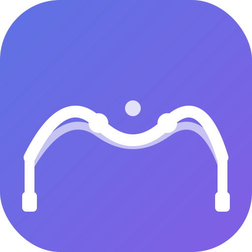
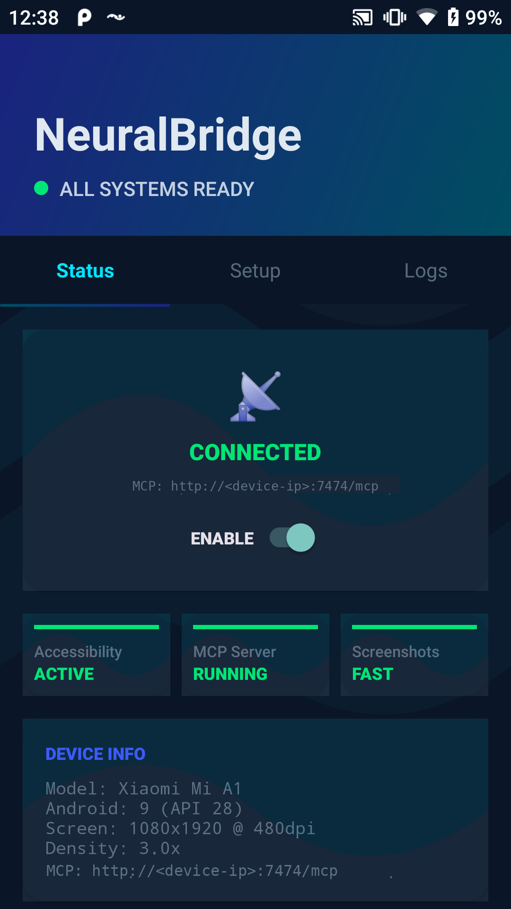
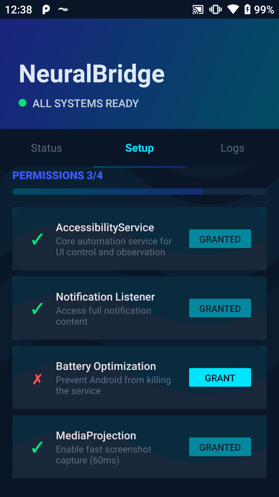
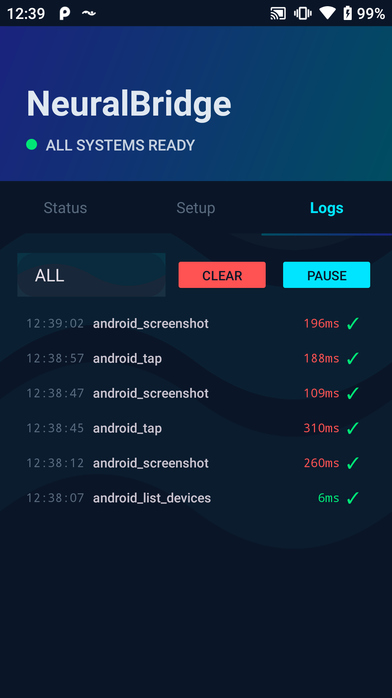
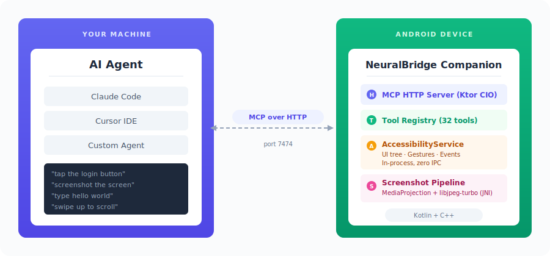

<p align="center">
  
</p>

<h1 align="center">🧠 NeuralBridge</h1>

<p align="center">
  <strong>AI-native Android automation via the Model Context Protocol</strong>
</p>

<p align="center">
  Give any AI agent — Claude, GPT, Gemini, or your own — full control over an Android device.<br/>
  Observe the UI. Tap. Swipe. Type. Manage apps. Capture screenshots.<br/>
  All with <strong>sub-100ms latency</strong>. No root required.
</p>

<p align="center">
  <a href="LICENSE"></a>
  <a href="CHANGELOG.md"></a>
  <a href="docs/TOOLS.md"></a>
  <a href="docs/PERFORMANCE.md"></a>
  <a href="#"></a>
  <a href="#"></a>
</p>

<p align="center">
  
  &nbsp;&nbsp;
  
  &nbsp;&nbsp;
  
</p>

---

## 🤔 Why NeuralBridge?

Existing Android automation falls into two camps — and both share the same bottleneck:

1. **Test frameworks** (Appium, Maestro) — built for QA, not AI agents. Every action routes through ADB or UIAutomator IPC, costing 200-1000ms per operation.
2. **MCP wrappers** (mobile-mcp, droidrun) — AI-aware, but thin ADB wrappers underneath. 200-2000ms per action.

NeuralBridge takes a different approach: an on-device AccessibilityService that executes actions **in-process**, eliminating IPC overhead entirely.

| | **NeuralBridge** | **Appium** | **Maestro** | **mobile-mcp** | **droidrun** | **ADB Shell** |
|---|:---:|:---:|:---:|:---:|:---:|:---:|
| ⚡ Tap latency | **~2ms** | 300-1000ms | 750ms-2s | 500-2000ms | 200-1000ms | 300-1000ms |
| ⌨️ Text input | **~1.4ms** | 500-3000ms | 750ms-2s | 500-2000ms | 200-1000ms | 500-2000ms |
| 🌳 UI tree read | **18-33ms** | 500-2000ms | 750ms-2s | 1-5s | 200-500ms | 1-5s |
| 📸 Screenshot | **~60ms** | 300-500ms | ~1s | 300-500ms | ~250ms | 300-500ms |
| 🔌 MCP native | **Yes** | Add-on | Yes (stdio) | Yes | Via adapter | No |
| 🛠️ MCP tools | **43** | 30+ (add-on) | 14+ | ~19 | ~11 | — |
| 🎯 Token optimization | **Yes (73%)** | No | No | No | No | No |

> [!TIP]
> **100x faster on average** — NeuralBridge averages **6.4ms** per action vs **~800ms** for Appium and **~1.5s** for mobile-mcp. [See full benchmarks →](docs/PERFORMANCE.md)

---

## 🏗️ How It Works

Your AI agent speaks MCP over HTTP directly to the companion app — no middleware, no ADB, no intermediate server.

<p align="center">
  
</p>

> [!NOTE]
> **1 hop, not 5.** Appium routes through HTTP → Appium Server → ADB → UIAutomator2 → Device. NeuralBridge goes Agent → HTTP → Companion App. The AccessibilityService runs in-process — like the difference between a phone call and a note on your own desk. [Deep dive →](docs/ARCHITECTURE.md)

---

## 🚀 Quickstart

**Prerequisites:** Android SDK (API 24+), Java JDK 17, Android device or emulator (7.0+)

### 1️⃣ Clone & Build

```bash
git clone https://github.com/dondetir/NeuralBridge_mcp.git
cd NeuralBridge_mcp/android
./gradlew assembleDebug
```

### 2️⃣ Install & Enable

```bash
# Install the companion app
adb install -r app/build/outputs/apk/debug/app-debug.apk

# Enable AccessibilityService
adb shell settings put secure enabled_accessibility_services \
  com.neuralbridge.companion/.service.NeuralBridgeAccessibilityService
adb shell settings put secure accessibility_enabled 1
```

> [!IMPORTANT]
> **Android 15+** requires an extra step: Settings → Apps → NeuralBridge → Enable **"Allow restricted settings"**

### 3️⃣ Connect Your AI Agent

The app shows its IP on the main screen. Add it to your agent's MCP config:

```bash
# Claude Code
claude mcp add neuralbridge http://<device-ip>:7474/mcp --transport http
```

<details>
<summary>📋 Manual config (Claude Desktop / any MCP client)</summary>

```json
{
  "mcpServers": {
    "neuralbridge": {
      "type": "http",
      "url": "http://<device-ip>:7474/mcp"
    }
  }
}
```

</details>

### 4️⃣ Verify

Ask your AI agent: *"Take a screenshot of the Android device"* — if you see a screenshot, you're connected! 🎉

---

## 📚 Documentation

| | Document | What's inside |
|---|---|---|
| 🏗️ | [**Architecture**](docs/ARCHITECTURE.md) | Data flow, command paths, selector system, limitations |
| 🛠️ | [**Tools Reference**](docs/TOOLS.md) | All 32 MCP tools with descriptions and latencies |
| ⚡ | [**Performance**](docs/PERFORMANCE.md) | Benchmarks, architecture comparison, token optimization |
| 🔧 | [**Troubleshooting**](docs/TROUBLESHOOTING.md) | Connection issues, permissions, screenshots, crashes |
| 🔨 | [**Development**](docs/DEVELOPMENT.md) | Building from source, project structure, protobuf, logs |
| 📱 | [**Android App**](android/README.md) | App-specific setup and permissions |
| 🤝 | [**Contributing**](CONTRIBUTING.md) | Code style, PR process, guidelines |
| 🔒 | [**Security**](SECURITY.md) | Vulnerability reporting policy |

---

## 🗺️ Roadmap

- [x] ~~Core MVP — 16 tools, TCP protocol, basic gestures~~
- [x] ~~Advanced gestures, selectors, event streaming, notifications~~
- [x] ~~Semantic resolver, scroll-to-element, accessibility audit, screenshot diff~~
- [ ] Multi-device, WebView tools, CI/CD integration, visual regression

---

## 🤝 Contributing

See [CONTRIBUTING.md](CONTRIBUTING.md) for guidelines. High-priority areas: additional MCP tools, performance optimizations, cross-platform support (iOS), and example demos.

---

## 📄 License

[Apache 2.0](LICENSE) — Copyright 2026 dondetir

> "Powered by [NeuralBridge](https://github.com/dondetir/NeuralBridge_mcp)"
