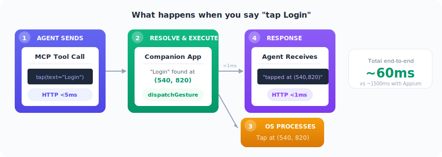
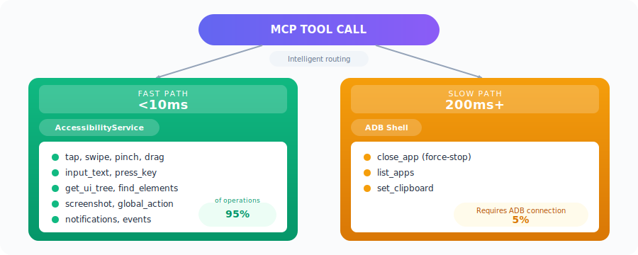
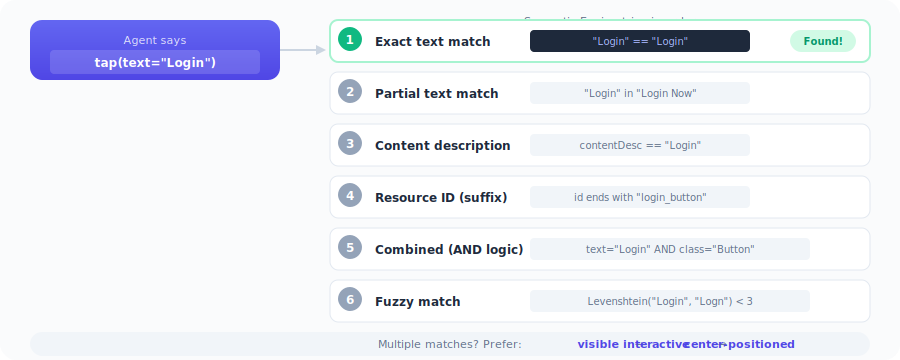

[← Back to README](../README.md)

---

# 🏗️ Architecture Overview

NeuralBridge is a two-tier system. Your AI agent speaks MCP over HTTP directly to the companion app — no middleware required.

The companion app runs an embedded HTTP server (Ktor CIO on port 7474) that implements the Model Context Protocol. When a tool call arrives, the app resolves it through its AccessibilityService — executing gestures, reading the UI tree, and capturing screenshots entirely in-process, without any IPC or ADB overhead.

  

---

# ⚡ Data Flow

### What happens when you say "tap Login"

The journey from natural language to a physical tap on glass takes four steps — and completes in roughly 60ms:

1. **Agent sends MCP tool call** — Your AI agent issues `android_tap(selector: "Login")` over HTTP to the companion app.
2. **Companion App resolves selector** — The Semantic Engine walks the accessibility tree, finds the "Login" button, resolves it to coordinates `(540, 820)`, and dispatches the gesture through the AccessibilityService.
3. **Android OS processes the tap** — The system injects the touch event into the target app's window.
4. **Agent receives response** — The companion app returns a success result with metadata (element found, coordinates used, timing).

Total: **~60ms end-to-end** vs ~1500ms with Appium.

  

---

# 🔀 The Two Command Paths

Not all operations are equal. NeuralBridge intelligently routes commands through the fastest available path.

### Fast Path — AccessibilityService (<10ms)

The fast path handles **95% of operations** by executing directly within the companion app's process. No IPC, no ADB, no process spawning.

| Operations | Latency |
|---|---|
| `tap`, `swipe`, `pinch`, `drag` | ~2ms |
| `input_text` | ~1.4ms |
| `press_key`, `global_action` | <5ms |
| `get_ui_tree` | 18–33ms |
| `find_elements` | <10ms |
| `screenshot` | ~60ms |
| `notifications`, `events` | <10ms |

### Slow Path — ADB Shell (200ms+)

The remaining **5% of operations** require ADB shell access for capabilities that Android restricts from accessibility services.

| Operations | Latency | Why ADB? |
|---|---|---|
| `close_app` (force-stop) | ~200ms | `am force-stop` requires shell |
| `list_apps` | ~200ms | Package manager query via shell |
| `set_clipboard` | <10ms | Background clipboard access restricted on Android 10+ |

  

---

# 🎯 Selector System

Most tools accept **selectors** instead of raw coordinates. This means your AI agent can say `tap(selector: "Login")` instead of `tap(x: 540, y: 820)` — making automation scripts readable, resilient to layout changes, and resolution-independent.

### The Resolution Priority Chain

When a selector arrives, the Semantic Engine walks the accessibility tree and resolves it through a six-step priority chain:

| Priority | Strategy | Example |
|---|---|---|
| 1 | **Exact text match** | `"Login"` == `"Login"` |
| 2 | **Partial text match** | `"Login"` found in `"Login Now"` |
| 3 | **Content description** | `contentDesc` == `"Login"` |
| 4 | **Resource ID (suffix)** | ID ends with `"login_button"` |
| 5 | **Combined (AND logic)** | `text="Login"` AND `class="Button"` |
| 6 | **Fuzzy match** | Levenshtein distance: `"Login"` vs `"Logn"` < 3 |

### Multiple Matches?

When more than one element matches, the engine applies a tiebreaker preference:

**Visible** → **Interactive** → **Center-positioned**

This ensures taps land on the most likely intended target — a visible, tappable button near the center of the screen beats a hidden or non-interactive element every time.

  

---

# ✅ What Works and What Doesn't

### Works Great (95% of use cases)

- **Native Android apps** — Settings, Calculator, Clock, Contacts, Files
- **Popular apps** — Chrome, YouTube, Gmail, Maps, social media, e-commerce
- **System UI** — Notifications, Quick Settings, Recent Apps, Launcher
- **Multi-step workflows** — Form filling, navigation, app switching
- **Accessibility testing** — Touch target audits, content description checks

### Limitations

| Limitation | Reason |
|---|---|
| Games (OpenGL/Unity/Unreal) | Canvas rendering — no accessibility tree |
| Banking apps with FLAG_SECURE | Screenshot blocked by the app |
| Biometric authentication | Cannot simulate fingerprint/face |
| CI/CD headless screenshots (Android 14+) | MediaProjection requires user consent |
| Google Play distribution | AccessibilityService policy restrictions |

---

  <a href="../README.md">← Back to README</a>

