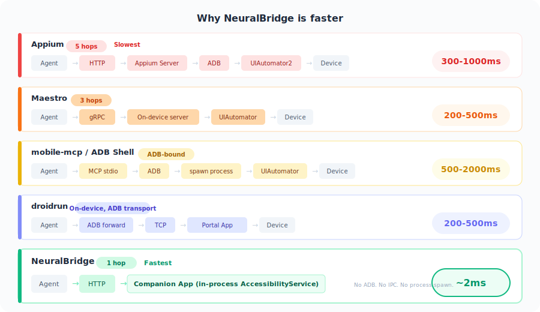
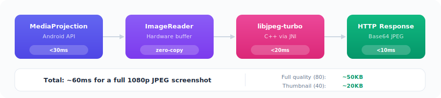

[← Back to README](../README.md)

# ⚡ Performance & Benchmarks

---

## 📊 Benchmarks

All NeuralBridge measurements taken on a Pixel-class device over WiFi HTTP. Competitor latencies sourced from official documentation, community benchmarks, and architectural analysis.

| Operation | NeuralBridge | Appium | Maestro | mobile-mcp | droidrun | ADB Shell |
|---|---|---|---|---|---|---|
| Tap | **~2ms** | 300-1000ms | 750ms-2s | 500-2000ms | 200-1000ms | 300-1000ms |
| Swipe | **~2ms** | 300-1000ms | 750ms-2s | 500-2000ms | 200-1000ms | 300-1000ms |
| Input text | **~1.4ms** | 500-3000ms | 750ms-2s | 500-2000ms | 200-1000ms | 500-2000ms |
| Get UI tree | **18-33ms** | 500-2000ms | 750ms-2s | 1-5s | 200-500ms | 1-5s |
| Screenshot | **~60ms** | 300-500ms | ~1s | 300-500ms | ~250ms | 300-500ms |
| Find elements | **<10ms** | 500-2000ms | 750ms-2s | 1-5s | 200-500ms | 1-5s |
| **Avg (actions)** | **6.4ms** | ~800ms | ~1.2s | ~1.5s | ~500ms | ~1.5s |

---

## 🏎️ Why So Fast?

  

🐌 **Why Appium is slow:** Multi-hop architecture — Client → HTTP → Appium Server → ADB → UIAutomator2 → Device. Each hop adds latency. Community reports show individual clicks at 300ms-1s, text input at 3-5s per field, and form-filling scenarios (40 fields) taking 17+ minutes. Has an MCP add-on (appium-mcp, 30+ tools) but inherits the same latency.

🐢 **Why Maestro is slowest per-action:** Maestro prioritizes reliability over speed. Every action triggers a mandatory 750ms settle wait (checking the UI is stable before acting). Benchmarks show Maestro completing a test scenario in ~30s vs Appium's ~14s for the same flow. Maestro's advantage is near-zero flakiness — not raw speed.

🐌 **Why mobile-mcp / ADB Shell are slow:** Every action spawns a new ADB shell process. Process creation alone costs 100-200ms, and `adb shell uiautomator dump` takes 1-5s depending on UI complexity.

🚶 **Why droidrun is moderate:** Has an on-device portal app with AccessibilityService (like NeuralBridge), but communicates via ADB-forwarded TCP. The ADB forwarding layer adds 200-500ms overhead per round-trip.

---

## 📸 Screenshot Pipeline

  

---

## 🎯 Token Optimization

When AI agents read UI trees, every token costs money and context window space. NeuralBridge compresses tool responses automatically:

| Optimization | Token Savings | What it does |
|---|---|---|
| Compact UI tree | 50-60% | Tabular format instead of verbose JSON |
| Interactive-only filter | ~80% node reduction | Only returns tappable/typeable elements |
| Compact bounds | 15-20% | `[l,t,r,b]` instead of `{"left":0,"top":0,...}` |
| Omit empty fields | 10-15% | Strips null/empty values from responses |
| Tool consolidation | Fewer tools exposed | Merges simple tools into parent tools |

A typical 200-node screen (50 interactive elements) goes from **~3,000 tokens to ~800 tokens** — a 73% reduction.

All optimizations are enabled by default and configured within the companion app.
